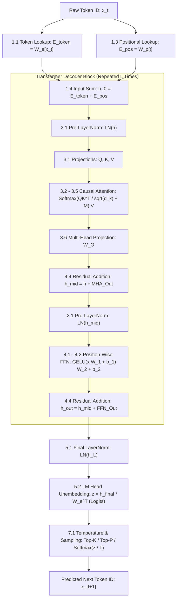

# 📐 Complete Mathematical Formulas of GPT: In Math, Words & Layman Terms

> A comprehensive, end-to-end mathematical reference for Generative Pre-trained Transformers (GPT-1, GPT-2, GPT-3, GPT-4, and modern variants). Every single equation is presented in three formats:
> 1. **Mathematical Notation** ($\LaTeX$)
> 2. **Word Form Equation** (Spelled out step-by-step in plain words)
> 3. **Layman Explanation & Intuition** (Real-world metaphors, why it exists, and what happens if removed)

---

## 🗺️ Master Table of Contents

1. [Architectural Overview & Dimensions Cheat Sheet](#-architectural-overview--dimensions-cheat-sheet)
2. [Phase 1: Input Representation & Embeddings](#-phase-1-input-representation--embeddings)
   - [1.1 Token Embedding Lookup](#11-token-embedding-lookup)
   - [1.2 Sinusoidal Absolute Positional Encoding](#12-sinusoidal-absolute-positional-encoding-gpt-1--transformer)
   - [1.3 Learned Absolute Positional Embedding](#13-learned-absolute-positional-embedding-gpt-2--gpt-3)
   - [1.4 Combined Input Representation](#14-combined-input-representation)
   - [1.5 Rotary Position Embedding (RoPE)](#15-rotary-position-embedding-rope-modern-gpt-variants)
3. [Phase 2: Normalization Layers](#-phase-2-normalization-layers)
   - [2.1 Standard Layer Normalization (LayerNorm)](#21-standard-layer-normalization-layernorm-gpt-2--gpt-3)
   - [2.2 RMSNorm (Root Mean Square Normalization)](#22-rmsnorm-root-mean-square-normalization-modern-gpt-variants)
   - [2.3 Pre-LayerNorm vs. Post-LayerNorm Formulation](#23-pre-layernorm-residual-formulation)
4. [Phase 3: Self-Attention & Multi-Head Attention](#-phase-3-self-attention--multi-head-attention-the-core-engine)
   - [3.1 Query, Key, and Value Linear Projections](#31-query-key-and-value-linear-projections)
   - [3.2 Scaled Dot-Product Attention](#32-scaled-dot-product-attention)
   - [3.3 The Scaling Factor Variance Proof](#33-the-scaling-factor-sqrt-d_k-variance-preservation)
   - [3.4 Causal Autoregressive Masking](#34-causal-autoregressive-masking)
   - [3.5 Numerically Stable Softmax](#35-numerically-stable-softmax)
   - [3.6 Multi-Head Attention (MHA) & Head Concatenation](#36-multi-head-attention-mha--output-projection)
   - [3.7 Multi-Query Attention (MQA) & Grouped-Query Attention (GQA)](#37-multi-query-mqa--grouped-query-attention-gqa)
   - [3.8 Key-Value Cache (KV-Cache) Autoregressive Step](#38-key-value-cache-kv-cache-mechanics)
5. [Phase 4: Feed-Forward Networks (FFN / MLP) & Residuals](#-phase-4-feed-forward-networks-ffn--residuals)
   - [4.1 Two-Layer Position-Wise Feed-Forward Network](#41-two-layer-position-wise-feed-forward-network)
   - [4.2 Gaussian Error Linear Unit (GELU)](#42-gaussian-error-linear-unit-gelu-activation)
   - [4.3 SwiGLU Gated Activation](#43-swiglu-gated-feed-forward-network-modern-variants)
   - [4.4 Residual Connection & Gradient Highway](#44-residual-connection--gradient-highway)
6. [Phase 5: Output Projection & Categorical Probabilities](#-phase-5-output-projection--probabilities)
   - [5.1 Final Layer Normalization](#51-final-layer-normalization)
   - [5.2 Output Projection (Unembedding Head) & Weight Tying](#52-output-projection-lm-head--weight-tying)
   - [5.3 Next-Token Probability Distribution](#53-next-token-probability-distribution)
7. [Phase 6: Training Loss & Evaluation Metrics](#-phase-6-training-loss--evaluation-metrics)
   - [6.1 Autoregressive Cross-Entropy Loss (Negative Log-Likelihood)](#61-autoregressive-cross-entropy-loss-nll)
   - [6.2 Perplexity (PPL)](#62-perplexity-ppl)
   - [6.3 Label Smoothing Loss](#63-label-smoothing-loss)
8. [Phase 7: Inference Decoding & Sampling Strategies](#-phase-7-inference-decoding--sampling-strategies)
   - [7.1 Temperature Scaling](#71-temperature-scaling)
   - [7.2 Top-K Sampling](#72-top-k-filtering--sampling)
   - [7.3 Top-P (Nucleus) Sampling](#73-top-p-nucleus-sampling)
   - [7.4 Repetition Penalty](#74-repetition-penalty)
9. [Phase 8: Optimization & Training Dynamics](#-phase-8-optimization--training-dynamics)
   - [8.1 AdamW Optimizer: First and Second Moment Estimates](#81-adamw-optimizer-first-and-second-moment-estimates)
   - [8.2 AdamW Optimizer: Bias Corrections](#82-adamw-bias-correction)
   - [8.3 AdamW Optimizer: Decoupled Weight Decay Parameter Update](#83-adamw-decoupled-weight-decay-parameter-update)
   - [8.4 Learning Rate Schedule (Linear Warmup + Cosine Decay)](#84-learning-rate-schedule-linear-warmup--cosine-decay)
   - [8.5 Global Gradient Norm Clipping](#85-global-gradient-norm-clipping)
10. [Phase 9: Compute, Memory, & Scaling Laws](#-phase-9-compute-memory--scaling-laws)
    - [9.1 Total GPT Parameter Count Derivation](#91-total-gpt-parameter-count-formula)
    - [9.2 Floating Point Operations (FLOPs) per Token](#92-floating-point-operations-flops-per-token)
    - [9.3 KV-Cache Memory Consumption Formula](#93-kv-cache-memory-consumption-formula)
    - [9.4 Chinchilla Optimal Scaling Law](#94-chinchilla-optimal-scaling-law)

---

## 📊 Architectural Overview & Dimensions Cheat Sheet

Before diving into the formulas, here is the standard tensor dimension notation used across the equations:

| Symbol | Mathematical Meaning | Standard GPT-2 Small | Standard GPT-3 (175B) |
| :--- | :--- | :--- | :--- |
| $B$ | Batch size (number of sequences processed simultaneously) | Dynamic (e.g., $32$) | Dynamic (e.g., $3.2\text{M}$ tokens) |
| $T$ / $S$ | Context length / Sequence length (number of tokens in input) | $1,024$ | $2,048$ |
| $V$ | Vocabulary size (total distinct subwords/tokens) | $50,257$ | $50,257$ |
| $d_{model}$ ($d$) | Hidden embedding dimension (width of the model) | $768$ | $12,288$ |
| $h$ | Number of attention heads | $12$ | $96$ |
| $d_k = d_v$ | Dimension of each attention head ($d_{model} / h$) | $64$ ($768 / 12$) | $128$ ($12,288 / 96$) |
| $d_{ff}$ | Intermediate dimension of Feed-Forward Network ($4 \times d_{model}$) | $3,072$ | $49,152$ |
| $L$ | Number of Transformer Decoder Layers (depth) | $12$ | $96$ |

---

## 🔤 Phase 1: Input Representation & Embeddings

### 1.1 Token Embedding Lookup

#### 📐 Mathematical Formula
$$E_{token} = x \cdot W_e \quad \text{or} \quad E_{token}[t] = W_e[x_t]$$

Where:
- $x_t \in \{0, 1, \dots, V - 1\}$ is the discrete token integer index at sequence position $t$.
- $W_e \in \mathbb{R}^{V \times d_{model}}$ is the token embedding weight matrix.
- $E_{token}[t] \in \mathbb{R}^{d_{model}}$ is the resulting continuous representation vector.

#### 🗣️ Formula in Word Form
$$\text{Token Vector} = \text{Extract row } x_t \text{ from Vocabulary Embedding Matrix } W_e$$

#### 💡 Layman Explanation
> **The Airport Luggage Tag Analogy**:
> A computer cannot do math on the text string `"apple"`. First, the tokenizer turns `"apple"` into an ID number, like ID `#1792`.
> The **Embedding Matrix** is a giant dictionary of $50,257$ shelves (one for every possible word/token ID). Each shelf contains a physical tray with $768$ numbers on it describing the "meaning" of that word (e.g., fruitiness, roundness, sweetness, syntax).
> The **Lookup** simply grabs tray `#1792`. That tray of numbers is the token's vector.

---

### 1.2 Sinusoidal Absolute Positional Encoding (GPT-1 / Transformer)

#### 📐 Mathematical Formula
$$PE_{(pos, 2i)} = \sin\left(\frac{pos}{10000^{\frac{2i}{d_{model}}}}\right)$$
$$PE_{(pos, 2i+1)} = \cos\left(\frac{pos}{10000^{\frac{2i}{d_{model}}}}\right)$$

Where:
- $pos \in \{0, 1, \dots, T - 1\}$ is the token's position index in the sequence (0th word, 1st word, etc.).
- $i \in \{0, 1, \dots, \frac{d_{model}}{2} - 1\}$ is the dimension index within the embedding vector.
- $2i$ represents even vector dimensions; $2i+1$ represents odd vector dimensions.

#### 🗣️ Formula in Word Form
$$\text{Even Dimension Value} = \text{Sine}\left(\frac{\text{Token Position}}{\text{Wavelength Scale}^{\text{Dimension Ratio}}}\right)$$
$$\text{Odd Dimension Value} = \text{Cosine}\left(\frac{\text{Token Position}}{\text{Wavelength Scale}^{\text{Dimension Ratio}}}\right)$$

#### 💡 Layman Explanation
> **The Clock Hands Analogy**:
> The attention mechanism has no innate concept of time or word order: `"dog bites man"` looks identical to `"man bites dog"`. We need a timestamp!
> Instead of writing a raw number like "Position 5", which could blow up for long texts, sinusoidal encodings create a unique fingerprint like the hands of an analog clock:
> - Lower dimensions oscillate rapidly like the **second hand** (ticks fast, distinguishes adjacent words).
> - Middle dimensions swing like the **minute hand**.
> - Higher dimensions move slowly like the **hour hand** (tracks long-distance position).
> Because of trigonometric identities ($\sin(A+B) = \sin A \cos B + \cos A \sin B$), the model can mathematically calculate the relative distance between any two words with a simple linear transformation.

---

### 1.3 Learned Absolute Positional Embedding (GPT-2 / GPT-3)

#### 📐 Mathematical Formula
$$E_{pos} = W_p[pos]$$

Where:
- $pos \in \{0, 1, \dots, T - 1\}$ is the token's 0-indexed position.
- $W_p \in \mathbb{R}^{T_{max} \times d_{model}}$ is a trainable weight matrix of position embeddings.

#### 🗣️ Formula in Word Form
$$\text{Position Vector} = \text{Extract row } pos \text{ from Learned Position Matrix } W_p$$

#### 💡 Layman Explanation
> **The Reserved Seat Numbers Analogy**:
> Instead of using pure math formulas (sine and cosine), GPT-2 and GPT-3 dedicate $2,048$ permanent rows in memory—one row specifically for the 1st word, one for the 2nd, up to the 2,048th word.
> During training, the neural network *learns* the best set of numbers to represent what it means to be "the opening word of a prompt" versus "a word near the end".

---

### 1.4 Combined Input Representation

#### 📐 Mathematical Formula
$$h_0 = E_{token} + E_{pos}$$

Where:
- $h_0 \in \mathbb{R}^{B \times T \times d_{model}}$ is the initial hidden state fed into Decoder Layer 1.

#### 🗣️ Formula in Word Form
$$\text{Combined Input Vector} = \text{Word Meaning Vector} + \text{Word Position Vector}$$

#### 💡 Layman Explanation
> **The Stamped Passport Analogy**:
> $E_{token}$ tells the model **what** the word is (e.g., `"doctor"`).
> $E_{pos}$ tells the model **where** the word sits (e.g., `"word #4"`).
> By adding them element-by-element, the single resulting vector simultaneously carries both the identity and the chronological timestamp of the word.

---

### 1.5 Rotary Position Embedding (RoPE) (Modern GPT Variants)

#### 📐 Mathematical Formula
$$R_{\Theta, m}^d = \text{diag}\left(R_{\theta_1, m}, R_{\theta_2, m}, \dots, R_{\theta_{d/2}, m}\right)$$
$$\text{where } R_{\theta_i, m} = \begin{pmatrix} \cos(m\theta_i) & -\sin(m\theta_i) \\ \sin(m\theta_i) & \cos(m\theta_i) \end{pmatrix}, \quad \theta_i = 10000^{-2(i-1)/d}$$
$$\tilde{q}_m = R_{\Theta, m}^d q_m, \quad \tilde{k}_n = R_{\Theta, n}^d k_n$$

The key inner-product property:
$$\langle \tilde{q}_m, \tilde{k}_n \rangle = \text{Re}\left( \langle q_m, k_n e^{i(m-n)\theta} \rangle \right) = g(q_m, k_n, m - n)$$

#### 🗣️ Formula in Word Form
$$\text{Rotated Vector} = \text{Group vector components in pairs and rotate each 2D pair by angle } (\text{Position } m \times \text{Frequency } \theta_i)$$

#### 💡 Layman Explanation
> **The Clock Dial Rotation Analogy**:
> Absolute position embeddings fail if you test the model on 4,000 tokens when it only trained on 2,048 tokens (it never learned seat #3000!).
> RoPE doesn't add position to the embedding. Instead, inside the attention mechanism, it **rotates** the Query and Key vectors in 2D pairs like hands on a clock.
> If word $A$ is at minute 10 and word $B$ is at minute 15, the angle between them is always **5 minutes**, regardless of whether the sentence started at 1:00 or 12:00. This gives the model natural, infinite relative distance reasoning.

---

## ⚖️ Phase 2: Normalization Layers

### 2.1 Standard Layer Normalization (LayerNorm) (GPT-2 / GPT-3)

#### 📐 Mathematical Formula
$$\mu = \frac{1}{d} \sum_{i=1}^{d} x_i$$
$$\sigma^2 = \frac{1}{d} \sum_{i=1}^{d} (x_i - \mu)^2$$
$$\hat{x}_i = \frac{x_i - \mu}{\sqrt{\sigma^2 + \epsilon}}$$
$$y_i = \gamma_i \odot \hat{x}_i + \beta_i$$

Where:
- $x \in \mathbb{R}^{d_{model}}$ is the vector of activations for a single token.
- $\mu \in \mathbb{R}$ is the mean across all hidden features for that token.
- $\sigma^2 \in \mathbb{R}$ is the variance across all hidden features.
- $\epsilon \approx 10^{-5}$ is a tiny constant preventing division by zero.
- $\gamma, \beta \in \mathbb{R}^{d_{model}}$ are learnable scale (gain) and shift (bias) parameters.

#### 🗣️ Formula in Word Form
$$\text{Feature Mean} = \frac{\text{Sum of all feature values}}{\text{Number of features}}$$
$$\text{Feature Variance} = \frac{\text{Sum of squared differences from Mean}}{\text{Number of features}}$$
$$\text{Standardized Vector} = \frac{\text{Raw Vector} - \text{Mean}}{\sqrt{\text{Variance} + \text{Epsilon}}}$$
$$\text{LayerNorm Output} = (\text{Learnable Scale} \times \text{Standardized Vector}) + \text{Learnable Bias}$$

#### 💡 Layman Explanation
> **The Sound Equalizer Analogy**:
> As signals pass through 96 layers of deep neural networks, numbers can easily explode into massive values (+5,000) or vanish into near-zeros (0.00001), causing crashes or halted learning.
> LayerNorm acts like an automatic studio sound compressor: for every single token independently, it centers its volume to 0 (subtracts mean) and rescales its volume range to 1 (divides by standard deviation).
> Then, the learnable knobs ($\gamma, \beta$) let the network gently adjust the tone to whatever optimal loudness it prefers.

---

### 2.2 RMSNorm (Root Mean Square Normalization) (Modern GPT Variants)

#### 📐 Mathematical Formula
$$\text{RMS}(x) = \sqrt{\frac{1}{d} \sum_{i=1}^{d} x_i^2 + \epsilon}$$
$$y_i = \frac{x_i}{\text{RMS}(x)} \odot \gamma_i$$

#### 🗣️ Formula in Word Form
$$\text{Root Mean Square} = \sqrt{\frac{\text{Sum of all squared elements}}{\text{Number of elements}} + \text{Epsilon}}$$
$$\text{RMSNorm Output} = \left(\frac{\text{Raw Vector}}{\text{Root Mean Square}}\right) \times \text{Learnable Scale}$$

#### 💡 Layman Explanation
> **The Streamlined Volume Normalizer**:
> Researchers discovered that the hardest part of LayerNorm—calculating the mean $\mu$ and shifting every number—doesn't actually help performance much. All the stability comes from dividing by the signal's energy (the root mean square).
> By skipping the mean subtraction, RMSNorm saves ~15% to 30% of memory access time on GPUs while maintaining identical mathematical stability.

---

### 2.3 Pre-LayerNorm Residual Formulation

#### 📐 Mathematical Formula
**GPT-1 (Post-LN):**
$$x^{(l)}_{mid} = \text{LayerNorm}\left(x^{(l-1)} + \text{Attention}(x^{(l-1)})\right)$$
$$x^{(l)} = \text{LayerNorm}\left(x^{(l)}_{mid} + \text{FFN}(x^{(l)}_{mid})\right)$$

**GPT-2 / GPT-3 (Pre-LN):**
$$x^{(l)}_{mid} = x^{(l-1)} + \text{Attention}\left(\text{LayerNorm}(x^{(l-1)})\right)$$
$$x^{(l)} = x^{(l)}_{mid} + \text{FFN}\left(\text{LayerNorm}(x^{(l)}_{mid})\right)$$

#### 🗣️ Formula in Word Form
$$\text{Intermediate State} = \text{Previous State} + \text{Attention}\left(\text{Normalized Previous State}\right)$$
$$\text{Layer Output} = \text{Intermediate State} + \text{FeedForward}\left(\text{Normalized Intermediate State}\right)$$

#### 💡 Layman Explanation
> **The Pristine Highway Analogy**:
> In GPT-1 (Post-LN), the main residual highway gets normalized at every single step, which squashes the gradients and makes 50+ layer models impossible to train without extreme warmup hacks.
> In GPT-2/3 (Pre-LN), the main highway remains untouched clean addition ($x + \dots$). We only take a normalized "exit ramp" to compute attention, and merge the result back onto the main highway. Gradients can flow backwards cleanly across 100 layers without diminishing.

---

## 🔍 Phase 3: Self-Attention & Multi-Head Attention (The Core Engine)

### 3.1 Query, Key, and Value Linear Projections

#### 📐 Mathematical Formula
$$Q = X W_Q + b_Q, \quad Q \in \mathbb{R}^{B \times T \times d_{model}}$$
$$K = X W_K + b_K, \quad K \in \mathbb{R}^{B \times T \times d_{model}}$$
$$V = X W_V + b_V, \quad V \in \mathbb{R}^{B \times T \times d_{model}}$$

For Multi-Head Attention with $h$ heads:
$$d_k = d_v = \frac{d_{model}}{h}$$
$$Q_i = X W_Q^{(i)}, \quad K_i = X W_K^{(i)}, \quad V_i = X W_V^{(i)} \quad \text{where } i \in \{1, \dots, h\}$$

#### 🗣️ Formula in Word Form
$$\text{Query Matrix } Q = \text{Input Representation } X \times \text{Query Weight Matrix } W_Q$$
$$\text{Key Matrix } K = \text{Input Representation } X \times \text{Key Weight Matrix } W_K$$
$$\text{Value Matrix } V = \text{Input Representation } X \times \text{Value Weight Matrix } W_V$$

#### 💡 Layman Explanation
> **The YouTube Search Analogy**:
> Every word needs to interact with every other word. To do this, each word projects itself into three roles:
> 1. **Query ($Q$)**: *"What am I searching for?"* (e.g., if the word is `"bank"`, its Query might ask: *"Are we talking about money or rivers?"*).
> 2. **Key ($K$)**: *"What is my title / what do I offer?"* (e.g., the earlier word `"river"` has a Key stating: *"I am a body of water"*).
> 3. **Value ($V$)**: *"What information do I give you if we match?"* (the actual content payload vector transferred to the query word).

---

### 3.2 Scaled Dot-Product Attention

#### 📐 Mathematical Formula
$$\text{Attention}(Q, K, V) = \text{Softmax}\left(\frac{Q K^T}{\sqrt{d_k}} + M\right) V$$

Where:
- $Q K^T \in \mathbb{R}^{T \times T}$ is the raw attention score matrix (dot-product affinity between all pairs of tokens).
- $\sqrt{d_k}$ is the temperature scaling factor (square root of head dimension).
- $M \in \mathbb{R}^{T \times T}$ is the causal autoregressive attention mask.
- $\text{Softmax}(\cdot)$ converts raw scores into valid probability distributions (rows sum to $1.0$).
- $V \in \mathbb{R}^{T \times d_v}$ is the matrix of value vectors.

#### 🗣️ Formula in Word Form
$$\text{Attention Output} = \text{Softmax}\left( \frac{\text{Query Matrix} \times \text{Transposed Key Matrix}}{\sqrt{\text{Key Dimension}}} + \text{Causal Mask} \right) \times \text{Value Matrix}$$

#### 💡 Layman Explanation
> **The Classroom Matchmaker**:
> 1. Multiply $Q$ and $K^T$: Every word compares its question with every other word's title. High score = "We are highly relevant to each other!"
> 2. Divide by $\sqrt{d_k}$: Softens the scores so numbers don't blow up (explained next).
> 3. Add Mask $M$: Blocks any word from peeking into the future.
> 4. Softmax: Turns the scores into percentage weights that add up to 100% (e.g., 70% attention to `"river"`, 20% to `"water"`, 10% to `"flow"`).
> 5. Multiply by $V$: Mixes together 70% of river's information, 20% of water's information, and 10% of flow's information into one rich, context-aware vector.

---

### 3.3 The Scaling Factor ($\frac{1}{\sqrt{d_k}}$) Variance Preservation

#### 📐 Mathematical Formula
Let $q, k \in \mathbb{R}^{d_k}$ be independent zero-mean, unit-variance random variables:
$$\mathbb{E}[q_i] = 0, \quad \text{Var}(q_i) = 1, \quad \mathbb{E}[k_i] = 0, \quad \text{Var}(k_i) = 1$$

The dot product is:
$$S = q \cdot k = \sum_{i=1}^{d_k} q_i k_i$$

Expectation and Variance:
$$\mathbb{E}[S] = \sum_{i=1}^{d_k} \mathbb{E}[q_i k_i] = \sum_{i=1}^{d_k} \mathbb{E}[q_i] \mathbb{E}[k_i] = 0$$
$$\text{Var}(S) = \sum_{i=1}^{d_k} \text{Var}(q_i k_i) = \sum_{i=1}^{d_k} \left(\mathbb{E}[q_i^2 k_i^2] - (\mathbb{E}[q_i k_i])^2\right) = \sum_{i=1}^{d_k} (1 \times 1 - 0) = d_k$$

Scaling by $\frac{1}{\sqrt{d_k}}$:
$$\text{Var}\left(\frac{q \cdot k}{\sqrt{d_k}}\right) = \frac{1}{(\sqrt{d_k})^2} \text{Var}(q \cdot k) = \frac{1}{d_k} \cdot d_k = 1$$

#### 🗣️ Formula in Word Form
$$\text{Variance of Unscaled Dot Product} = \text{Head Dimension } d_k$$
$$\text{Variance of Scaled Dot Product} = \frac{\text{Variance of Raw Dot Product}}{(\sqrt{d_k})^2} = \frac{d_k}{d_k} = 1.0$$

#### 💡 Layman Explanation
> **The Megaphone / Whispering Analogy**:
> If you add up $64$ random numbers, the variance is $64$, meaning numbers easily reach $+20$ or $-20$.
> If you feed $+20$ into a Softmax function, $e^{20}$ is **$485,165,195$**! The Softmax output becomes a one-hot vector (one token gets 99.999% and all other tokens get 0.000%).
> When Softmax becomes that extreme, its mathematical gradient becomes basically $0$ (vanishing gradient), and the network completely stops learning!
> Dividing by $\sqrt{64} = 8$ shrinks the numbers back into a gentle range (around $-2$ to $+2$), keeping the gradients alive and healthy.

---

### 3.4 Causal Autoregressive Masking

#### 📐 Mathematical Formula
$$M_{ij} = \begin{cases} 0 & \text{if } i \ge j \\ -\infty & \text{if } i < j \end{cases}$$

Applying inside Softmax:
$$\left(\frac{Q K^T}{\sqrt{d_k}} + M\right)_{ij} = \begin{cases} \frac{q_i \cdot k_j}{\sqrt{d_k}} & \text{if } i \ge j \\ -\infty & \text{if } i < j \end{cases}$$
$$\text{Since } \lim_{z \to -\infty} e^z = 0, \quad \text{Softmax}(-\infty) = 0$$

#### 🗣️ Formula in Word Form
$$\text{Mask Value at Row } i, \text{ Column } j = \begin{cases} 0 & \text{if position } j \text{ is in the past or present relative to } i \\ -\infty & \text{if position } j \text{ is in the future relative to } i \end{cases}$$

#### 💡 Layman Explanation
> **The Open-Book Exam Blinders**:
> GPT is trained to predict the next word. If Word #2 could look ahead and see Word #3, it wouldn't learn to predict—it would just cheat!
> The causal mask puts an iron curtain over all future words by setting their score to negative infinity ($-\infty$). Because $e^{-\infty} = 0$, the probability of paying attention to any future word is strictly $0\%$.

---

### 3.5 Numerically Stable Softmax

#### 📐 Mathematical Formula
Standard Softmax:
$$\text{Softmax}(z_i) = \frac{e^{z_i}}{\sum_{j=1}^{N} e^{z_j}}$$

Numerically Stable Softmax:
$$m = \max_{j}(z_j)$$
$$\text{Softmax}(z_i) = \frac{e^{z_i - m}}{\sum_{j=1}^{N} e^{z_j - m}}$$

#### 🗣️ Formula in Word Form
$$\text{Stable Softmax of Logit } i = \frac{\text{Exp}(\text{Logit } i - \text{Maximum Logit in Row})}{\text{Sum of Exp of all (Logits in Row} - \text{Maximum Logit in Row})}$$

#### 💡 Layman Explanation
> **The Overflow Guard**:
> Standard floating-point numbers on computers blow up (Overflow to `NaN` / Infinity) if you calculate $e^{z}$ when $z > 88$.
> By subtracting the biggest number ($m$) from all numbers before running exponential, the largest number becomes $e^0 = 1.0$, and all other numbers are negative ($e^{\text{negative}} \in (0, 1)$). The result is mathematically identical because $\frac{e^{z_i - m}}{\sum e^{z_j - m}} = \frac{e^{z_i} e^{-m}}{e^{-m} \sum e^{z_j}} = \frac{e^{z_i}}{\sum e^{z_j}}$, but it guarantees zero computer crashes.

---

### 3.6 Multi-Head Attention (MHA) & Output Projection

#### 📐 Mathematical Formula
$$\text{head}_i = \text{Attention}\left(Q W_Q^{(i)}, K W_K^{(i)}, V W_V^{(i)}\right) = \text{Attention}(Q_i, K_i, V_i)$$
$$\text{MultiHead}(Q, K, V) = \text{Concat}(\text{head}_1, \text{head}_2, \dots, \text{head}_h) W_O$$

Where:
- Each $\text{head}_i \in \mathbb{R}^{B \times T \times d_k}$.
- $\text{Concat}(\dots) \in \mathbb{R}^{B \times T \times (h \cdot d_k)} = \mathbb{R}^{B \times T \times d_{model}}$.
- $W_O \in \mathbb{R}^{d_{model} \times d_{model}}$ is the final multi-head projection weight matrix.

#### 🗣️ Formula in Word Form
$$\text{Single Head Output} = \text{Scaled Dot-Product Attention on Head's } Q_i, K_i, V_i$$
$$\text{Multi-Head Output} = \text{Concatenate all } h \text{ head outputs side-by-side} \times \text{Output Projection Matrix } W_O$$

#### 💡 Layman Explanation
> **The Committee of Specialists**:
> If you only have one single attention mechanism, it can only focus on one relationship at a time (e.g., grammar).
> Multi-Head Attention splits the $768$-dimensional vector into $12$ parallel $64$-dimensional mini-spaces.
> - Head 1 focuses on: *"Who is doing the action to whom?"* (subject-verb agreement).
> - Head 2 focuses on: *"What does the pronoun 'it' refer to?"* (coreference resolution).
> - Head 3 focuses on: *Rhyming or poetic rhythm*.
> At the end, we stitch all 12 perspectives together side-by-side and multiply by $W_O$ so the heads can synthesize their collective findings.

---

### 3.7 Multi-Query (MQA) & Grouped-Query Attention (GQA)

#### 📐 Mathematical Formula
Let $h_q$ be the number of query heads, and $h_{kv}$ be the number of key/value heads.

- **Standard Multi-Head Attention (MHA)**: $h_{kv} = h_q$ (every query head has its own key/value head).
- **Multi-Query Attention (MQA)**: $h_{kv} = 1$ (all query heads share one single key/value head).
- **Grouped-Query Attention (GQA)**: $1 < h_{kv} < h_q$, with group ratio $g = \frac{h_q}{h_{kv}}$.

For group $g \in \{1, \dots, h_{kv}\}$:
$$\text{head}_j = \text{Attention}\left(Q_j, K_g, V_g\right) \quad \text{for } j \in \text{group}(g)$$

#### 🗣️ Formula in Word Form
$$\text{GQA Attention for Head } j = \text{Attention}(\text{Query Head } j, \text{Shared Group Key } K_g, \text{Shared Group Value } V_g)$$

#### 💡 Layman Explanation
> **The Shared Textbook Analogy**:
> In standard MHA, if there are 8 students (Query heads), each student insists on having their own heavy textbook (Key/Value vectors). Storing 8 textbooks in GPU memory (KV-cache) crashes the system when 1,000 users chat at once.
> In GQA (used in modern GPT models and LLaMA-3), we group students into pairs of 4. Each group of 4 students shares **one single textbook**. This cuts memory usage by 75% while keeping model intelligence virtually identical.

---

### 3.8 Key-Value Cache (KV-Cache) Mechanics

#### 📐 Mathematical Formula
At generation step $t$:
$$K_{cached}^{(t)} = \left[ K_{cached}^{(t-1)} \, ; \, K_t \right] \in \mathbb{R}^{B \times h_{kv} \times t \times d_k}$$
$$V_{cached}^{(t)} = \left[ V_{cached}^{(t-1)} \, ; \, V_t \right] \in \mathbb{R}^{B \times h_{kv} \times t \times d_k}$$
$$Q_t = x_t W_Q \in \mathbb{R}^{B \times h_q \times 1 \times d_k}$$
$$\text{Attention}_t = \text{Softmax}\left(\frac{Q_t \left(K_{cached}^{(t)}\right)^T}{\sqrt{d_k}}\right) V_{cached}^{(t)} \in \mathbb{R}^{B \times h_q \times 1 \times d_k}$$

Computational complexity per token generated:
- Without Cache: $\mathcal{O}(t^2 \cdot d)$ (recomputes all past tokens from scratch every step).
- With Cache: $\mathcal{O}(t \cdot d)$ (only computes query for the 1 new token, reuses past keys and values).

#### 🗣️ Formula in Word Form
$$\text{Updated Cached Keys} = \text{Concatenate Previous Cached Keys with New Token's Key Vector}$$
$$\text{Updated Cached Values} = \text{Concatenate Previous Cached Values with New Token's Value Vector}$$
$$\text{New Token Attention} = \text{Softmax}\left(\frac{\text{Single New Query} \times \text{All Cached Keys}^T}{\sqrt{\text{Key Dimension}}}\right) \times \text{All Cached Values}$$

#### 💡 Layman Explanation
> **The Notepad vs. Re-reading the Entire Book**:
> When generating the 500th word, the model needs to know what the first 499 words were.
> Without KV caching, the model would re-encode words 1 through 499 from scratch, taking exponentially longer with every single new word.
> With KV caching, the model writes down the Keys and Values of past words on a notepad. To produce word 500, it only computes **one** single Query for word 499, looks up the notepad, and writes the answer. Generating tokens becomes lightning-fast.

---

## ⚡ Phase 4: Feed-Forward Networks (FFN) & Residuals

### 4.1 Two-Layer Position-Wise Feed-Forward Network

#### 📐 Mathematical Formula
$$\text{FFN}(x) = \sigma(x W_1 + b_1) W_2 + b_2$$

Where:
- $x \in \mathbb{R}^{B \times T \times d_{model}}$.
- $W_1 \in \mathbb{R}^{d_{model} \times d_{ff}}$ expands dimension, typically $d_{ff} = 4 \times d_{model}$ (e.g., $768 \to 3072$).
- $\sigma(\cdot)$ is the non-linear activation function (GELU in GPT).
- $W_2 \in \mathbb{R}^{d_{ff} \times d_{model}}$ projects back down (e.g., $3072 \to 768$).
- $b_1 \in \mathbb{R}^{d_{ff}}, b_2 \in \mathbb{R}^{d_{model}}$ are bias vectors.

#### 🗣️ Formula in Word Form
$$\text{FFN Output} = \text{Activation}\left( \text{Input} \times \text{Expansion Matrix } W_1 + \text{Bias } b_1 \right) \times \text{Compression Matrix } W_2 + \text{Bias } b_2$$

#### 💡 Layman Explanation
> **The Library Fact Retrieval & Reflection**:
> If Attention is about *routing* information between different words in a sentence ("Who relates to Whom?"), the FFN is where the model stores its *encyclopedic knowledge* ("What are the facts?").
> The vector is blown up to 4x its size so millions of memorized patterns and facts can be checked in parallel, transformed through non-linear reasoning, and then compressed back to standard size.

---

### 4.2 Gaussian Error Linear Unit (GELU) Activation

#### 📐 Mathematical Formula
Exact Definition:
$$\text{GELU}(x) = x \cdot P(X \le x) = x \cdot \Phi(x) = x \cdot \frac{1}{2} \left[ 1 + \text{erf}\left(\frac{x}{\sqrt{2}}\right) \right]$$

Standard GPT-2 / GPT-3 Tanh Approximation:
$$\text{GELU}(x) \approx 0.5x \left( 1 + \tanh\left(\sqrt{\frac{2}{\pi}} \left(x + 0.044715 x^3\right)\right) \right)$$

#### 🗣️ Formula in Word Form
$$\text{GELU Output} = \text{Input } x \times \text{Probability that a Standard Normal Variable is less than or equal to } x$$

#### 💡 Layman Explanation
> **The Probabilistic Bouncer**:
> In older networks (ReLU), if an incoming number is negative, it gets abruptly slammed to zero ($0$). If positive, it passes through unchanged. This "hard cliff" kills neurons permanently.
> GELU is a smooth, gentle bouncer: if a number is positive, it almost certainly passes through. If a number is slightly negative (like $-0.5$), it still has a tiny chance of passing through. This continuous curvature prevents dead neurons and smooths gradient flow during training.

---

### 4.3 SwiGLU Gated Feed-Forward Network (Modern Variants)

#### 📐 Mathematical Formula
$$\text{Swish}_\beta(x) = x \cdot \text{sigmoid}(\beta x)$$
$$\text{SwiGLU}(x) = \left( \text{Swish}_1(x W_{gate}) \odot x W_{up} \right) W_{down}$$

Where:
- $W_{gate}, W_{up} \in \mathbb{R}^{d_{model} \times \frac{8}{3}d_{model}}$
- $W_{down} \in \mathbb{R}^{\frac{8}{3}d_{model} \times d_{model}}$
- $\odot$ is the Hadamard (element-wise) product.

#### 🗣️ Formula in Word Form
$$\text{SwiGLU Output} = \left( \text{Swish}(\text{Input} \times \text{Gate Matrix}) \odot (\text{Input} \times \text{Up Matrix}) \right) \times \text{Down Matrix}$$

#### 💡 Layman Explanation
> **The Intelligent Valve**:
> Instead of just running an activation function over a vector, SwiGLU creates two separate pathways: an "Information Road" ($W_{up}$) and a "Control Gate" ($W_{gate}$).
> The Control Gate dynamically computes a multiplier between $0.0$ and $1.0$ for every single feature, acting like a smart dimmer switch that selectively suppresses irrelevant knowledge before projecting downward.

---

### 4.4 Residual Connection & Gradient Highway

#### 📐 Mathematical Formula
Forward Pass:
$$x_{l} = x_{l-1} + \mathcal{F}(x_{l-1}, W_l)$$

Backward Pass (Chain Rule across $L$ layers down to layer $l$):
$$\frac{\partial \mathcal{L}}{\partial x_l} = \frac{\partial \mathcal{L}}{\partial x_L} \frac{\partial x_L}{\partial x_l} = \frac{\partial \mathcal{L}}{\partial x_L} \left( I + \frac{\partial}{\partial x_l} \sum_{k=l}^{L-1} \mathcal{F}(x_k, W_k) \right)$$

#### 🗣️ Formula in Word Form
$$\text{Next Layer State} = \text{Previous Layer State} + \text{Sublayer Transformation}$$
$$\text{Gradient at Layer } l = \text{Loss Gradient at Top Layer} \times \left( \text{Identity Matrix } I + \text{Accumulated Sublayer Gradients} \right)$$

#### 💡 Layman Explanation
> **The Gradient Express Elevator**:
> Without residual connections ($+ x_{l-1}$), backpropagation requires multiplying gradients through 100 matrices in a row. If each matrix multiplies by $0.9$, $0.9^{100} \approx 0.00002$ (the gradient completely dies, and early layers never learn).
> The $+ x_{l-1}$ produces an **Identity Matrix ($I$)** in the backward derivative. This provides an express elevator with zero friction: gradients from the final loss can travel directly down to the very first layer untouched!

---

## 🎯 Phase 5: Output Projection & Probabilities

### 5.1 Final Layer Normalization

#### 📐 Mathematical Formula
$$h_{final} = \text{LayerNorm}(x_L) \in \mathbb{R}^{B \times T \times d_{model}}$$

#### 🗣️ Formula in Word Form
$$\text{Final Hidden State} = \text{LayerNorm}(\text{Output of the } L\text{-th Transformer Decoder Layer})$$

#### 💡 Layman Explanation
> **The Final Polish**:
> After passing through 12 to 96 transformer blocks, the hidden vector numbers can have shifted slightly. We run one final LayerNorm to ensure the vector standard deviations and means are strictly bounded before projecting to the vocabulary.

---

### 5.2 Output Projection (LM Head) & Weight Tying

#### 📐 Mathematical Formula
Without Weight Tying:
$$z_t = h_{final, t} W_U + b_U \quad \text{where } W_U \in \mathbb{R}^{d_{model} \times V}, \quad z_t \in \mathbb{R}^{V}$$

With Weight Tying (as in GPT-2):
$$W_U = W_e^T \implies z_t = h_{final, t} W_e^T$$

Where:
- $z_t$ is the vector of raw, unnormalized prediction scores (**logits**) over the entire vocabulary of $V$ words.
- $W_e$ is the token embedding matrix from Phase 1.

#### 🗣️ Formula in Word Form
$$\text{Logits Vector } z_t = \text{Final Hidden Representation} \times \text{Transposed Vocabulary Embedding Matrix } W_e^T$$

#### 💡 Layman Explanation
> **The Word Reverse-Lookup**:
> In Phase 1, we converted token IDs into $768$-dimensional vectors using $W_e$.
> Now, at the very end of the model, we do the exact reverse: we compare the final $768$-dimensional thought vector with all $50,257$ word vectors by taking their dot product. Words whose vectors point in the same direction as the thought vector receive a high logit score.

---

### 5.3 Next-Token Probability Distribution

#### 📐 Mathematical Formula
$$P(x_{t+1} = w_i \mid x_{1:t}) = \frac{e^{z_{t, i}}}{\sum_{j=1}^{V} e^{z_{t, j}}}$$

#### 🗣️ Formula in Word Form
$$\text{Probability of Word } i = \frac{\text{Exponential of Logit for Word } i}{\text{Sum of Exponentials of Logits for all } V \text{ Words in Dictionary}}$$

#### 💡 Layman Explanation
> **The Odds Maker**:
> Logit scores can be anything: $+14.2$, $-3.1$, $+0.5$.
> Softmax takes every score, turns it into a positive number via $e^z$, and divides by the total sum so that all $50,257$ probabilities strictly add up to $100.0\%$.

---

## 📉 Phase 6: Training Loss & Evaluation Metrics

### 6.1 Autoregressive Cross-Entropy Loss (NLL)

#### 📐 Mathematical Formula
For a sequence of tokens $x = (x_1, x_2, \dots, x_T)$:
$$\mathcal{L}_{CE} = -\frac{1}{T} \sum_{t=1}^{T} \log P(x_t \mid x_{<t}; \theta)$$

Expressed in terms of target token index $y_t \in \{1, \dots, V\}$ and model logits $z_t$:
$$\mathcal{L}_{CE} = \frac{1}{T} \sum_{t=1}^{T} \left( -z_{t, y_t} + \log \sum_{j=1}^{V} e^{z_{t, j}} \right)$$

#### 🗣️ Formula in Word Form
$$\text{Average Cross-Entropy Loss} = -\frac{1}{\text{Sequence Length}} \sum_{\text{each token}} \text{Natural Log of Model's Probability for the Real Next Word}$$

#### 💡 Layman Explanation
> **The Penalty for Being Wrong**:
> If the ground-truth next word is `"cat"`:
> - If the model assigned a $99\%$ probability to `"cat"`, $-\log(0.99) = 0.01$ (almost zero penalty, great job!).
> - If the model assigned a $1\%$ probability to `"cat"`, $-\log(0.01) = 4.60$ (massive penalty!).
> - If the model assigned $0\%$ probability, $-\log(0) = \infty$ (infinite penalty!).
> Training simply adjusts all billions of weights in the network to make this penalty as close to zero as possible.

---

### 6.2 Perplexity (PPL)

#### 📐 Mathematical Formula
$$\text{PPL} = \exp(\mathcal{L}_{CE}) = \exp\left(-\frac{1}{T} \sum_{t=1}^{T} \log P(x_t \mid x_{<t})\right) = \left( \prod_{t=1}^{T} \frac{1}{P(x_t \mid x_{<t})} \right)^{\frac{1}{T}}$$

#### 🗣️ Formula in Word Form
$$\text{Perplexity} = e^{\text{Average Cross-Entropy Loss}}$$

#### 💡 Layman Explanation
> **The Multiple-Choice Guessing Factor**:
> Perplexity answers: *"On average, how many equally likely words is the model confused between?"*
> - If Perplexity = **$50,257$**: The model is guessing completely randomly across the entire dictionary.
> - If Perplexity = **$10$**: The model is as uncertain as picking between 10 equally plausible words.
> - If Perplexity = **$1.0$**: Absolute perfection! The model knows the exact next word with 100% certainty every single time. Lower is always better.

---

### 6.3 Label Smoothing Loss

#### 📐 Mathematical Formula
$$y_{smoothed}(k) = (1 - \alpha) \cdot y_{one\_hot}(k) + \frac{\alpha}{V}$$
$$\mathcal{L}_{LS} = (1 - \alpha) \mathcal{L}_{CE} + \frac{\alpha}{V} \sum_{k=1}^{V} \left( -\log P(w_k) \right)$$

Where $\alpha \in (0, 1)$ is the smoothing hyperparameter (typically $0.1$).

#### 🗣️ Formula in Word Form
$$\text{Smoothed Label for Correct Word} = (1 - \alpha) + \frac{\alpha}{\text{Vocabulary Size}}$$
$$\text{Smoothed Label for Incorrect Words} = \frac{\alpha}{\text{Vocabulary Size}}$$

#### 💡 Layman Explanation
> **The Humility Pill**:
> Standard cross-entropy forces the network to become 100% overconfident in its training set, which can cause overfitting.
> Label smoothing tells the model: *"Give 90% confidence to the true word, but spread the remaining 10% evenly across all other 50,000 words."* This prevents weights from growing astronomically large and makes the model generalize better to unseen prompts.

---

## 🎲 Phase 7: Inference Decoding & Sampling Strategies

### 7.1 Temperature Scaling

#### 📐 Mathematical Formula
$$P_i(T) = \frac{\exp(z_i / T)}{\sum_{j=1}^{V} \exp(z_j / T)}$$

Limiting Behaviors:
$$\lim_{T \to 0^+} P_i(T) = \begin{cases} 1 & \text{if } i = \arg\max_k(z_k) \\ 0 & \text{otherwise} \end{cases} \quad \text{(Greedy / Argmax Decoding)}$$
$$\lim_{T \to \infty} P_i(T) = \frac{1}{V} \quad \text{(Completely Uniform Random)}$$

#### 🗣️ Formula in Word Form
$$\text{Scaled Probability of Word } i = \frac{\text{Exponential}\left(\frac{\text{Logit } i}{\text{Temperature } T}\right)}{\text{Sum of Exponentials of all }\left(\frac{\text{Logits}}{\text{Temperature } T}\right)}$$

#### 💡 Layman Explanation
> **The Creativity Thermostat**:
> - **Low Temperature ($T = 0.1$)**: Divides logits by $0.1$ (multiplies by $10$). The highest score shoots to the moon; all other words get crushed to $0$. The model becomes strictly logical, repetitive, and predictable.
> - **Standard Temperature ($T = 0.7 - 1.0$)**: Natural balance between fluent grammar and creative word choice.
> - **High Temperature ($T = 2.0$)**: Flattens all differences. Rare words get picked frequently, resulting in bizarre, highly creative, or nonsensical gibberish.

---

### 7.2 Top-K Filtering & Sampling

#### 📐 Mathematical Formula
$$V^{(K)} = \arg\max_{S \subset V, |S|=K} \sum_{i \in S} z_i$$
$$z'_i = \begin{cases} z_i & \text{if } i \in V^{(K)} \\ -\infty & \text{otherwise} \end{cases}$$
$$P_i = \text{Softmax}(z'_i)$$

#### 🗣️ Formula in Word Form
$$\text{Filtered Vocabulary} = \text{Keep only the top } K \text{ tokens with the highest logits, and set all others to } -\infty$$
$$\text{Final Sampling Probabilities} = \text{Renormalize Softmax across those } K \text{ survivor tokens}$$

#### 💡 Layman Explanation
> **The Top-K Elimination Tourney**:
> If $K = 50$, the model discards the bottom $50,207$ words in the dictionary completely! Even if temperature is high, the model is physically prevented from picking an absurd, out-of-context word that was ranked #14,000.

---

### 7.3 Top-P (Nucleus) Sampling

#### 📐 Mathematical Formula
Find the minimal set of top tokens $V^{(p)} \subset V$ such that:
$$\sum_{i \in V^{(p)}} P(x_i \mid x_{<t}) \ge p$$

Where $P$ is sorted in descending order: $P(x_{(1)}) \ge P(x_{(2)}) \ge \dots \ge P(x_{(V)})$.
Renormalize over the nucleus:
$$P'_i = \begin{cases} \frac{P_i}{\sum_{j \in V^{(p)}} P_j} & \text{if } i \in V^{(p)} \\ 0 & \text{otherwise} \end{cases}$$

#### 🗣️ Formula in Word Form
$$\text{Nucleus Set} = \text{Smallest group of highest-probability words whose combined probability reaches threshold } p \text{ (e.g., } 0.90\text{)}$$
$$\text{Renormalized Probability} = \frac{\text{Word Probability}}{\text{Sum of Probabilities in Nucleus}}$$

#### 💡 Layman Explanation
> **The Dynamic Crowd Filter**:
> Fixed Top-$K$ has a fatal flaw: if the next word is obvious (e.g., `"The Eiffel..."` $\to$ `"Tower"` with 98% probability), Top-$50$ still leaves 49 random words in play!
> Nucleus sampling dynamically expands and contracts:
> - If the next word is obvious, the nucleus contains **only 1 word** (`"Tower"`).
> - If the context is open-ended (e.g., `"She wore a..."`), the top 90% might span **120 different colors and garments**.

---

### 7.4 Repetition Penalty

#### 📐 Mathematical Formula
Given logits $z_i$ and the set of generated token IDs in the context window $C$:
$$z'_i = \begin{cases} z_i / \theta & \text{if } i \in C \text{ and } z_i > 0 \\ z_i \cdot \theta & \text{if } i \in C \text{ and } z_i \le 0 \\ z_i & \text{if } i \notin C \end{cases}$$

Where $\theta > 1.0$ is the penalty factor (typically $\theta \approx 1.15$).

#### 🗣️ Formula in Word Form
$$\text{Penalized Logit} = \begin{cases} \text{Divide positive logit by penalty } \theta & \text{if word already appeared in text} \\ \text{Multiply negative logit by penalty } \theta & \text{if word already appeared in text} \end{cases}$$

#### 💡 Layman Explanation
> **The Broken Record Brake**:
> Transformers can get trapped in repetitive loops (*"I went to the store and then to the store and then to the store..."*).
> Repetition penalty checks if a word has already been spoken. If yes, it forcefully knocks down its logit score, forcing the model to pick fresh synonyms instead.

---

## 🚀 Phase 8: Optimization & Training Dynamics

### 8.1 AdamW Optimizer: First and Second Moment Estimates

#### 📐 Mathematical Formula
$$g_t = \nabla_\theta \mathcal{L}(\theta_{t-1})$$
$$m_t = \beta_1 m_{t-1} + (1 - \beta_1) g_t$$
$$v_t = \beta_2 v_{t-1} + (1 - \beta_2) g_t^2$$

Default Hyperparameters: $\beta_1 = 0.9, \; \beta_2 = 0.95 \text{ (or } 0.98\text{)}, \; \epsilon = 10^{-8}$.

#### 🗣️ Formula in Word Form
$$\text{Momentum (1st Moment } m_t\text{)} = (0.9 \times \text{Old Momentum}) + (0.1 \times \text{Current Gradient})$$
$$\text{Velocity / Friction (2nd Moment } v_t\text{)} = (0.95 \times \text{Old Velocity}) + (0.05 \times \text{Current Gradient Squared})$$

#### 💡 Layman Explanation
> **The Heavy Ball on a Hilly Terrain**:
> - $m_t$ (Momentum) acts like physical momentum: if the ball has been rolling in one direction for 10 steps, a tiny bump in the road won't stop it from plowing forward.
> - $v_t$ (Friction) tracks how volatile the terrain is: if a parameter receives violent, erratic gradient spikes, $v_t$ grows huge to automatically hit the brakes.

---

### 8.2 AdamW: Bias Correction

#### 📐 Mathematical Formula
$$\hat{m}_t = \frac{m_t}{1 - \beta_1^t}$$
$$\hat{v}_t = \frac{v_t}{1 - \beta_2^t}$$

Where $t \ge 1$ is the current training iteration step number.

#### 🗣️ Formula in Word Form
$$\text{Unbiased Momentum } \hat{m}_t = \frac{\text{Raw Momentum } m_t}{1 - \beta_1^{\text{Step Number } t}}$$
$$\text{Unbiased Velocity } \hat{v}_t = \frac{\text{Raw Velocity } v_t}{1 - \beta_2^{\text{Step Number } t}}$$

#### 💡 Layman Explanation
> **The Cold-Start Compensation**:
> At step $t=1$, momentum starts at $0$. With $\beta_1 = 0.9$, the first step would only take $10\%$ of the gradient, artificially crippling early training.
> Dividing by $(1 - 0.9^1) = 0.1$ scales step 1 back up to $100\%$. As step $t$ grows large ($t \to \infty$), $0.9^t \to 0$, so $(1 - 0) = 1.0$, and the correction gracefully fades away.

---

### 8.3 AdamW: Decoupled Weight Decay Parameter Update

#### 📐 Mathematical Formula
$$\theta_t = \theta_{t-1} - \eta_t \frac{\hat{m}_t}{\sqrt{\hat{v}_t} + \epsilon} - \eta_t \lambda \theta_{t-1}$$

Where:
- $\eta_t$ is the learning rate at step $t$.
- $\lambda$ is the decoupled weight decay coefficient (e.g., $0.01$ or $0.1$).
- $\epsilon \approx 10^{-8}$ prevents division by zero.

#### 🗣️ Formula in Word Form
$$\text{New Weight} = \text{Old Weight} - \left( \text{Learning Rate} \times \frac{\text{Unbiased Momentum}}{\sqrt{\text{Unbiased Velocity}} + \epsilon} \right) - \left( \text{Learning Rate} \times \text{Weight Decay} \times \text{Old Weight} \right)$$

#### 💡 Layman Explanation
> **The Weight Pruner**:
> In standard Adam, L2 weight decay got mixed into the variance calculation, ruining its effectiveness.
> AdamW cleanly decouples it: every single step, after moving in the direction of the gradient, it gently shrinks the weight towards zero by a fraction ($\lambda$). This prevents any single neuron from hoarding massive numbers and memorizing the training data.

---

### 8.4 Learning Rate Schedule: Linear Warmup + Cosine Decay

#### 📐 Mathematical Formula
During Warmup ($t \le T_{warmup}$):
$$\eta_t = \eta_{max} \cdot \frac{t}{T_{warmup}}$$

During Cosine Annealing ($T_{warmup} < t \le T_{max}$):
$$\eta_t = \eta_{min} + \frac{1}{2} (\eta_{max} - \eta_{min}) \left( 1 + \cos\left( \frac{t - T_{warmup}}{T_{max} - T_{warmup}} \pi \right) \right)$$

#### 🗣️ Formula in Word Form
$$\text{Warmup LR} = \text{Peak Learning Rate} \times \frac{\text{Current Step}}{\text{Warmup Steps}}$$
$$\text{Cosine LR} = \text{Minimum LR} + \frac{1}{2} (\text{Peak LR} - \text{Minimum LR}) \times \left( 1 + \cos\left(\frac{\text{Current Step} - \text{Warmup Steps}}{\text{Total Steps} - \text{Warmup Steps}} \times \pi\right) \right)$$

#### 💡 Layman Explanation
> **The Flight Takeoff and Landing**:
> - **Warmup (Takeoff)**: You don't hit full throttle immediately. Starting at 0 and ramping up gently prevents early random gradients from wrecking initial embeddings.
> - **Cosine Decay (Gentle Landing)**: At the middle of training, the model takes large strides. Near the end, it glides smoothly along a half-cosine curve down to a tiny learning rate, carefully settling into the deepest, most optimal valley of the loss landscape.

---

### 8.5 Global Gradient Norm Clipping

#### 📐 Mathematical Formula
$$\|g\|_2 = \sqrt{\sum_{i=1}^{P} g_i^2}$$
$$g_{clipped} = \begin{cases} g & \text{if } \|g\|_2 \le c \\ g \cdot \frac{c}{\|g\|_2} & \text{if } \|g\|_2 > c \end{cases}$$

Where:
- $\|g\|_2$ is the L2 norm across all $P$ parameters in the entire model.
- $c$ is the maximum allowable gradient threshold (typically $c = 1.0$).

#### 🗣️ Formula in Word Form
$$\text{Total Gradient Magnitude} = \sqrt{\text{Sum of all squared gradients in entire model}}$$
$$\text{Clipped Gradient} = \text{Gradient} \times \min\left(1.0, \frac{\text{Max Threshold } c}{\text{Total Gradient Magnitude}}\right)$$

#### 💡 Layman Explanation
> **The Surge Protector**:
> Occasionally, a corrupted sentence or batch produces an astronomical gradient (e.g., norm = $500.0$). If updated directly, it would detonate the network's weights.
> Gradient clipping acts as a fuse: if the total vector length exceeds $1.0$, it scales the vector down to exactly length $1.0$ while **preserving its exact direction**. The direction is preserved, but the explosion is neutralized.

---

## 🧮 Phase 9: Compute, Memory, & Scaling Laws

### 9.1 Total GPT Parameter Count Formula

#### 📐 Mathematical Formula
For a GPT model with vocabulary $V$, hidden size $d$, layers $L$, and FFN dimension $4d$:

1. **Embedding Layer**:
   $$N_{embed} = V \cdot d \quad (+ T_{max} \cdot d \text{ if learned positional embeddings})$$
2. **Per Transformer Layer**:
   - Q, K, V projections + biases: $3 \times (d \cdot d + d) = 3d^2 + 3d$
   - Output projection + bias: $d \cdot d + d = d^2 + d$
   - LayerNorms (2 per layer, each with scale and shift): $2 \times (2d) = 4d$
   - FFN up-projection ($d \to 4d$): $d \cdot 4d + 4d = 4d^2 + 4d$
   - FFN down-projection ($4d \to d$): $4d \cdot d + d = 4d^2 + d$
   - **Total per layer**:
     $$N_{layer} = (3d^2 + d^2 + 4d^2 + 4d^2) + (3d + d + 4d + 4d + d) = 12d^2 + 13d$$
3. **Total Non-Embedding Parameters**:
   $$N_{non\_embed} = L \cdot (12d^2 + 13d) \approx 12 L d^2$$
4. **Total Model Parameters**:
   $$N_{total} \approx 2 \cdot V \cdot d + 12 L d^2$$

#### 🗣️ Formula in Word Form
$$\text{Total Parameters} \approx (2 \times \text{Vocab} \times \text{Hidden Dimension}) + 12 \times \text{Number of Layers} \times (\text{Hidden Dimension})^2$$

#### 💡 Layman Explanation
> **The Blueprint Calculation**:
> - Why $12 d^2$? Each attention block has 4 matrices of size $d \times d$ ($4 d^2$). Each standard FFN has an expansion matrix of $d \times 4d$ and compression matrix of $4d \times d$ ($8 d^2$). $4 + 8 = 12 d^2$ per layer!
> - Multiply by number of layers $L$, add the word dictionary ($V \times d$), and you have the exact parameter count.

---

### 9.2 Floating Point Operations (FLOPs) per Token

#### 📐 Mathematical Formula
Forward Pass (Inference):
$$\text{FLOPs}_{fwd} \approx 2N \quad \text{FLOPs per token}$$

Training Pass (Forward + Backward with Gradient Calculation):
$$\text{FLOPs}_{train} \approx 6N \quad \text{FLOPs per token}$$

Total Training Compute for $D$ tokens:
$$C \approx 6 N D \quad \text{FLOPs}$$

*(Where each matrix multiplication of an $M \times K$ by $K \times N$ matrix requires $2 M K N$ operations: 1 multiply + 1 accumulate).*

#### 🗣️ Formula in Word Form
$$\text{Inference FLOPs per Token} = 2 \times \text{Total Parameter Count } N$$
$$\text{Training FLOPs per Token} = 6 \times \text{Total Parameter Count } N$$
$$\text{Total Training Compute} = 6 \times \text{Parameters } N \times \text{Total Training Tokens } D$$

#### 💡 Layman Explanation
> **The Universal Compute Rule-of-Thumb**:
> - For every single parameter in a forward pass, the computer performs roughly 1 multiplication and 1 addition ($2$ FLOPs).
> - During training, backpropagation requires calculating gradients for activations ($+2$ FLOPs) and gradients for weights ($+2$ FLOPs). Total: $2 + 2 + 2 = 6$ FLOPs per parameter per token!
> - If you train a 70-Billion parameter model on 2 Trillion tokens: $C = 6 \times (70 \times 10^9) \times (2 \times 10^{12}) = 8.4 \times 10^{23}$ FLOPs.

---

### 9.3 KV-Cache Memory Consumption Formula

#### 📐 Mathematical Formula
$$\text{Memory}_{KV} = 2 \times 2 \times n_{layers} \times n_{kv\_heads} \times d_{head} \times s \times b \times \text{bytes\_per\_element}$$

Where:
- First $2$: Stores both Keys ($K$) and Values ($V$).
- Second $2$: Precision bytes (e.g., 2 bytes for FP16 / BF16, 1 byte for INT8).
- $s$: Sequence context length (tokens).
- $b$: Concurrent batch size (active users).

#### 🗣️ Formula in Word Form
$$\text{KV Cache Bytes} = 4 \times \text{Number of Layers} \times \text{KV Heads} \times \text{Head Dimension} \times \text{Sequence Length} \times \text{Batch Size}$$

#### 💡 Layman Explanation
> **The VRAM Hunger Equation**:
> While model weights sit statically in memory, the KV cache grows dynamically with every single word every active user generates!
> For GPT-3 175B at FP16 with 2,048 tokens and a batch size of 64:
> $\text{Memory}_{KV} = 2 \times 2 \times 96 \times 96 \times 128 \times 2048 \times 64 \times 2 \approx \mathbf{618 \text{ GB of VRAM}}$ just for the notepad! This formula dictates how many GPUs are needed to serve real-time users.

---

### 9.4 Chinchilla Optimal Scaling Law

#### 📐 Mathematical Formula
$$L(N, D) = E + \frac{A}{N^\alpha} + \frac{B}{D^\beta}$$

Where optimal allocation under compute budget $C = 6ND$ yields:
$$N_{opt} \propto C^a, \quad D_{opt} \propto C^b \quad \text{where } a \approx 0.5, \; b \approx 0.5$$
$$D_{opt} \approx 20 \times N_{opt}$$

#### 🗣️ Formula in Word Form
$$\text{Optimal Training Tokens} \approx 20 \times \text{Total Model Parameters}$$

#### 💡 Layman Explanation
> **The Balanced Diet Rule**:
> For years (including GPT-3), people trained giant models on too little data (GPT-3 had 175B parameters but only 300B tokens—ratio of 1.7:1).
> DeepMind's Chinchilla law proved that to get the most intelligence per dollar spent on electricity:
> **For every 1 parameter in your model, you should feed it 20 tokens of high-quality data.**
> A 7B parameter model should be trained on 140B tokens; a 70B model should be trained on 1.4 Trillion tokens.

---

## 📌 Summary Matrix: The Complete GPT Forward Pass Pipeline

To see how all these mathematical formulas connect in sequence from user prompt to generated token:

