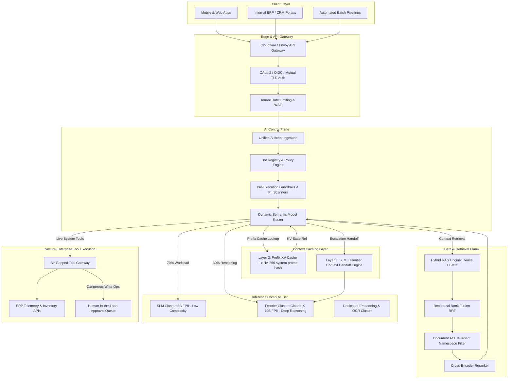

# 01. Enterprise Multi-Tenant AI Platform Architecture

## Executive Overview
This document specifies the target architecture for a centralized, multi-tenant Generative AI control and data plane engineered for an enterprise conglomerate operating across diverse subsidiaries (e.g., manufacturing, infrastructure, consumer services, and internal enterprise functions).

Rather than permitting fragmented, shadow AI deployments with siloed LLM wrappers, this platform provides a unified **`/v1/chat` Inference Gateway**, a dynamic **Bot Registry**, semantic **Model Routing**, and **Air-Gapped Tool Execution**.

---

## 🏛️ System Architecture Topology



---

## 🎯 Key Architectural Subsystems

### 1. Unified `/v1/chat` Gateway & Bot Registry
* **Single Contract**: All enterprise client applications interact with standard OpenAI-compatible endpoints (`/v1/chat/completions`, `/v1/embeddings`).
* **Bot Registry (`/v1/bots`)**: Central metadata catalog containing:
  - System prompts and domain instructions
  - Associated vector knowledge bases (`kb_id`s)
  - Authorized tools (`allowed_tools`, `restricted_tools`)
  - Target model routing policy (`dynamic_routed`, `force_frontier`, `slm_only`)
  - RBAC role requirements (`required_role: plant_engineer`)

### 2. Tiered Model Routing (SLM vs Frontier)
Sending 100% of enterprise queries to frontier reasoning models causes runaway costs and latency spikes.
* **Tier 1 — Small Language Models (SLMs, 8B FP8)**:
  - Handles ~70% of enterprise queries (FAQ lookup, entity extraction, summarization, metadata tagging, JSON schema formatting).
  - TTFT: ~250–350ms, Cost: ~$0.0002 / 1K tokens.
* **Tier 2 — Frontier Models (Claude-X / 70B+ FP8)**:
  - Handles ~30% complex analytical workloads (root-cause diagnostics, multi-hop legal analysis, code generation, financial synthesis).
  - TTFT: ~800–1000ms, Cost: ~$0.0035 / 1K tokens.

### 3. Server-Sent Events (SSE) Streaming & Connection Resilience
* Real-time token streaming over HTTP/2 SSE connections.
* **Client Disconnect Handling**: Immediate termination of inference context via ASGI disconnect listeners to prevent GPU compute waste on abandoned sessions.
* **Semantic Response Caching**: Redis-backed cache for identical enterprise queries, bypassing LLM inference entirely for static corporate policies.

### 4. Failure Domain Isolation & High Availability
* **GPU Worker Health Probes**: Real-time monitoring of vLLM worker health. Unhealthy worker nodes are evicted within 5 seconds.
* **Fallback Degradation**: If the Frontier cluster experiences transient saturation or failover, requests automatically degrade to an optimized SLM with explicit warning metadata in the response headers.
* **$N+1$ Redundancy**: Minimum 1 spare serving replica provisioned per cluster group to guarantee 99.9%+ availability during maintenance and node drains.

---

### 4. Context Caching Layer — Prefix KV-Cache & Cross-Model Handoff

A three-layer caching hierarchy minimises redundant token computation and cross-tier
escalation costs. Full specification: [`06_CONTEXT_CACHING_STRATEGY.md`](./06_CONTEXT_CACHING_STRATEGY.md).

* **Layer 1 — Semantic Response Cache (Redis)**: Full response deduplication for
  identical or near-identical enterprise queries. ~15–25% hit rate on FAQ/policy bots.
* **Layer 2 — Prefix KV-Cache** (`src/control_plane/context_cache.py`): SHA-256 keyed
  cache of transformer KV-state block references for shared bot system prompts.
  After the first cold request, subsequent requests skip re-processing the shared prefix
  (equivalent to Anthropic Prompt Caching / Google Context Caching / vLLM
  `enable_prefix_caching`). Yields **~90% token cost reduction** on cached prefix tokens.
* **Layer 3 — Cross-Model Context Handoff**: When the Dynamic Router escalates a
  multi-turn SLM session to Frontier, the prior conversation history is compressed
  into a <100-token summary via the `handoff_context()` engine, preventing full cold
  re-processing of prior turns at frontier token prices.

Every `/v1/chat/completions` response includes observability metadata:

```json
{
  "cache_metadata": {
    "layer1_semantic": "MISS",
    "layer2_prefix": "HIT",
    "prefix_tokens_saved": 1800,
    "estimated_cost_saved_usd": 0.000054,
    "layer3_handoff_active": false
  }
}
```
