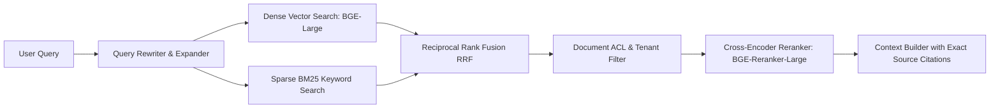

# 03. Enterprise RAG Pipeline & Zero-Trust Tool Governance

## Architectural Imperative
Enterprise knowledge retrieval differs fundamentally from consumer chatbots. A conglomerate deals with strict data governance, trade secrets, confidential salary scales, and plant operational controls. 

This document details:
1. **Hybrid Retrieval with Reciprocal Rank Fusion (RRF)**
2. **Document-Level Access Control Lists (ACLs)**
3. **Zero-Trust, Air-Gapped Tool Calling & Write Gates**

---

## 🔍 1. Enterprise Hybrid Retrieval Pipeline



### Reciprocal Rank Fusion (RRF) Formula
To combine sparse lexical matches (exact part numbers, serial codes, employee IDs) with dense semantic embeddings without scale sensitivity:

$$\text{RRF\_Score}(d) = \sum_{m \in \{\text{Dense}, \text{BM25}\}} \frac{1}{k + r_m(d)}$$

Where $k = 60$, and $r_m(d)$ is the rank position of document chunk $d$ in system $m$.

---

## 🛡️ 2. Multi-Tenant Document ACLs & Namespace Isolation

* **Isolated Namespaces**: Vector databases (Milvus / Qdrant) maintain tenant-partitioned collections (`tenant_steel`, `tenant_power`, `tenant_retail`).
* **Document-Level Metadata Filtering**:
  ```json
  {
    "document_id": "doc_turbine_repair_sop_v4",
    "tenant_id": "tenant_power_generation",
    "department": "operations",
    "access_clearance": ["plant_engineer", "safety_officer"],
    "confidentiality": "RESTRICTED",
    "valid_until": "2027-12-31"
  }
  ```
* **Pre-Retrieval Filter Injection**: The gateway automatically injects `$and: [{tenant_id: user.tenant_id}, {access_clearance: {$in: user.roles}}]` into every vector query, making cross-department or cross-tenant data leaks impossible at the retrieval layer.

---

## ⚙️ 3. Air-Gapped Tool Calling & Authorization

For live enterprise systems (SAP ERP, Oracle Inventory, SCADA Telemetry), models must never hold direct database credentials or unmonitored write access.

### Zero-Credential Architecture
```
[LLM] ──(Generates Structured Tool Call JSON)──► [Air-Gapped Tool Gateway]
                                                           │
                                                           ▼
                                            [Token Validation & RBAC Check]
                                                           │
               ┌───────────────────────────────────────────┴──────────────────────────────────────────┐
               ▼ (Read Operation: telemetry/inventory)                                                ▼ (Write Operation: machine stop/payroll edit)
      [Execute via IAM Vault]                                                                 [Human-in-the-Loop Approval Gate]
               │                                                                                      │
               ▼                                                                                      ▼
  [Return JSON to LLM]                                                                    [Notify Supervisor Dashboard]
```

### Operational Rules:
1. **Read Operations** (`query_part_stock`, `get_machine_telemetry`): Executed immediately by the gateway using short-lived OAuth tokens issued by HashiCorp Vault.
2. **Write & Dangerous Operations** (`trigger_valve_cutoff`, `modify_payroll_record`): The gateway intercepts the invocation, holds execution in a transactional queue, and returns `status: "APPROVAL_REQUIRED"`. Execution proceeds only after an authenticated supervisor signs off via web hook or portal.
