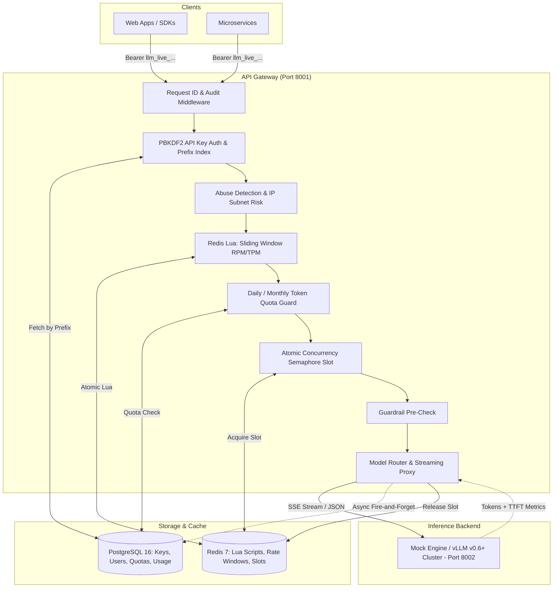

# 07. Production-Grade LLM API Gateway Layer

## Executive Overview

Serving self-hosted Large Language Models (vLLM, TGI, Ollama) introduces architectural constraints that traditional CRUD APIs never encounter:
- **Streaming duration:** Requests hold open HTTP connections for seconds or minutes (up to 120s+).
- **Asymmetric compute cost:** One request can consume 4,000 GPU KV-cache slots and $0.05 of compute.
- **Dual-dimension rate limiting:** Limiting Requests Per Minute (RPM) is insufficient; **Tokens Per Minute (TPM)** and **Active Concurrency Slots** dictate whether the GPU cluster OOMs.
- **Early client disconnects:** When a user closes a browser tab, streaming must abort immediately to release GPU resources.

This layer implements a production-grade, OpenAI-compatible API Gateway running on port **8001**, backed by PostgreSQL 16 (durable state & billing), Redis 7 (sliding window counters & atomic concurrency slots), and a simulated or live vLLM inference cluster.

---

## 🏛️ Gateway Architecture Topology



---

## 🔑 Core Subsystems

### 1. High-Performance API Key Authentication
- **Format:** `llm_{env}_{prefix8}_{secret32}` (e.g., `llm_live_a1b2c3d4_...`).
- **Database Query:** Uses the 8-character plaintext prefix to fetch the candidate key in $O(1)$ time.
- **Verification:** Cryptographically compares PBKDF2-SHA256 hashes (`passlib`) with constant-time comparison, preventing timing attacks without scanning the entire database.
- **Zero Raw Key Logging:** The `_redact_secrets` structlog processor scrubs headers and authorization payloads before writing to standard out.

### 2. Redis Lua Sliding Window Rate Limiter
Standard fixed-window counters suffer from the 2x burst vulnerability at window boundaries. We execute an atomic Redis Lua script using a sorted set (`ZSET`):
1. Removes entries older than $(now - 60s)$.
2. Counts remaining entries within the window.
3. If below limit, inserts $(now, UUID)$ and sets an automatic 60-second TTL.
4. Returns `[allowed, current_count, retry_after]`.

### 3. Concurrency Semaphore & Backpressure
LLM inference is concurrency-bound. The gateway provides an atomic Redis Lua concurrency slot manager:
- Checks `SCARD slots:{user_id}` against `max_concurrent`.
- Adds request ID with an automatic 300s expiration (preventing orphaned locks on server crash).
- The `InferenceService` wraps the downstream streaming call in a `try...finally` block, ensuring the slot is returned to Redis even on client disconnection.

### 4. Streaming SSE & Client Disconnect Handling
Streaming responses use Server-Sent Events (`text/event-stream`):
- Measures **Time to First Token (TTFT)**.
- Monitors `request.is_disconnected()`. If the client closes the connection, the generator terminates and stops pulling chunks from vLLM.
- Calculates and logs actual prompt tokens, completion tokens, and TTFT latency.

### 5. Durable Usage Tracking
Upon stream completion or non-streaming delivery:
- Records a `UsageEvent` in PostgreSQL asynchronously (`background_tasks`).
- Increments Redis daily/monthly hot counters.
- Provides FinOps auditability and tenant chargeback metrics.

---

## 🚀 Running the Gateway

### Launching via Docker Compose

```bash
docker compose up -d
```

Services started:
- `gateway`: Enterprise Control Plane on port `8000`
- `api-gateway`: Production LLM Gateway on port `8001`
- `mock-inference`: vLLM Simulator on port `8002`
- `postgres`: PostgreSQL 16 on port `5432`
- `redis`: Redis 7 on port `6379`

### Zero-Friction Developer Key
On first startup, the gateway seeds a local developer account and prints an active API key to logs:
```bash
docker compose logs api-gateway | grep "DEVELOPMENT API KEY GENERATED"
```

### Making a Request
```bash
curl -X POST http://localhost:8001/v1/chat/completions \
  -H "Authorization: Bearer <DEV_API_KEY>" \
  -H "Content-Type: application/json" \
  -d '{
    "model": "meta-llama/Llama-3-8b-Instruct",
    "messages": [{"role": "user", "content": "Explain GPU memory bandwidth"}],
    "stream": true
  }'
```
